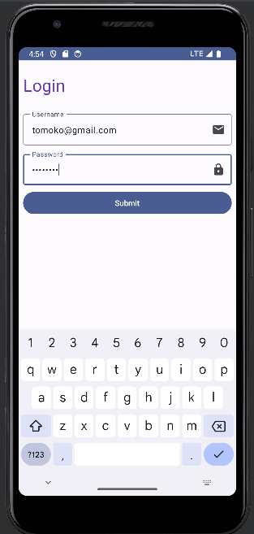

# Login Form

This Android app implements a simple login form user interface (UI) without actual functionality for validating or executing logins. It provides basic fields for entering a username and password.

## Features
- Basic UI for a login form with required fields
- Proper keyboard options for email and password text fields
- Visual transformation for password field to display "dots" instead of actual characters
- Ability to run the app on an emulator or real device to view the UI

## Getting Started
To run this project locally, follow these steps:

1. Clone this repository to your local machine.
2. Open the project in Android Studio.
3. Build and run the project on an Android emulator or physical device.

## Usage
Launch the app on your device to view the login form UI. Enter a username and password (no validation is performed). Press the "Submit" button, although no action will be taken as the app does not have actual login functionality.

## License
This project is licensed under the MIT License.
